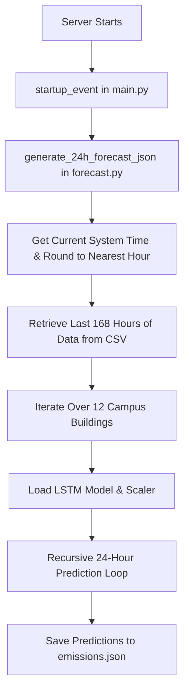

# 🌍 Campus Carbon Pulse - Backend Architecture & Documentation

This document explains the architecture, file structure, data pipeline, and API endpoints of the **Campus Carbon Pulse** backend.

---

## 📁 File Structure Overview

Inside the `backend/` directory, the codebase is organized as follows:

```
backend/
├── venv/                       # Python Virtual Environment
├── models/                     # Trained LSTM neural network models (*.keras & scalers)
├── main.py                     # FastAPI web server, API endpoints, and file automation
├── forecast.py                 # LSTM prediction logic and recursive forecasting
├── emissions.json              # Current 24-hour forecasted emissions data
├── campus.json                 # Reference building coordinates
├── snuc_carbon_year_2025.csv   # Historical campus carbon emission dataset
└── requirements.txt            # Python dependencies (FastAPI, TensorFlow, google-genai, etc.)
```

---

## ⚙️ Data Pipeline & Prediction Flow



### 1. Startup Automation
When the FastAPI server starts, the `@app.on_event("startup")` hook fires and calls the `generate_24h_forecast_json()` function inside [forecast.py](file:///c:/myspace/GDG/carbon-pulse/backend/forecast.py).

### 2. Recursive LSTM Forecasting
For each of the 12 campus buildings:
1. **Context Window**: The script retrieves the last 168 data points (7 days * 24 hours) of historical carbon emissions ending at the current hour from `snuc_carbon_year_2025.csv`.
2. **Preprocessing**: It scales the historical data using a pre-trained `MinMaxScaler` (`scaler_{building_id}.joblib`).
3. **Recursive Loop**:
   - The model predicts the next hour.
   - The predicted value is appended to the input window, displacing the oldest value (rolling window).
   - This process repeats 24 times to generate predictions for the next 24 hours.
4. **Output**: The real-world values are reconstructed (inverse scaled) and written to [emissions.json](file:///c:/myspace/GDG/carbon-pulse/backend/emissions.json).

---

## 📡 API Endpoints & Request/Response Flow

FastAPI runs on `http://localhost:8000` and serves three main endpoints:

### 1. `GET /get-emissions/{target_hour}`
Called by the frontend dashboard as the user moves the time slider (0–23).

* **Logic**:
  1. Reads the forecasted values from [emissions.json](file:///c:/myspace/GDG/carbon-pulse/backend/emissions.json) for the selected hour.
  2. Calculates a global min/max across all buildings/hours to standardize the scale.
  3. Computes a relative emission percentage (`scaled_emission`) from `0.0` to `100.0`.
  4. Calls `update_geojson_file()` (see below) to inject these values into the frontend's map.
* **Response Format**:
  ```json
  {
    "hour": 10,
    "results": [
      {
        "building_id": "Academic_Block_Large",
        "total_emission": 110.77,
        "scaled_emission": 70.5
      },
      ...
    ]
  }
  ```

### 2. `GET /get-historical-data/{days}`
Called by the analytics panel to render the historical trends charts.

* **Logic**:
  1. Reads the raw CSV file [snuc_carbon_year_2025.csv](file:///c:/myspace/GDG/carbon-pulse/backend/snuc_carbon_year_2025.csv).
  2. Filters data for the last $N$ days from the most recent timestamp in the dataset.
  3. Sums emissions across all buildings hourly, then aggregates those sums into daily averages.
* **Response Format**:
  ```json
  {
    "days": 7,
    "data": [
      {
        "date": "Jun 29",
        "carbon": 8540.23,
        "buildings": 12
      },
      ...
    ]
  }
  ```

### 3. `GET /get-insights`
Called when the user clicks the "Get Insights" button to request AI-driven recommendations.

* **Logic**:
  1. Computes campus-wide metrics from [emissions.json](file:///c:/myspace/GDG/carbon-pulse/backend/emissions.json) (total emissions, average hourly emissions, peak hour, and top 3 polluting buildings).
  2. Configures a connection to the Google Gemini API using the new `google-genai` SDK Client and your `GEMINI_API_KEY`.
  3. Transmits an analytical prompt containing the real data and requests a structured JSON response.
  4. Parses the model response and returns it to the client.
* **Response Format**:
  ```json
  {
    "success": true,
    "insights": {
      "summary": "...",
      "categories": [
        {
          "type": "peak_hours",
          "title": "Peak Emission Periods",
          "items": [{"title": "...", "description": "...", "value": "..."}]
        },
        ...
      ]
    }
  }
  ```

---

## 🗺️ Live GeoJSON Automation (`update_geojson_file`)

To allow the 3D map to update dynamically without querying the database constantly, the backend writes data directly into the map configuration file.

* **Trigger**: Every time the frontend requests emissions for a specific hour via `/get-emissions/{target_hour}`, the backend triggers `update_geojson_file(results)`.
* **Action**:
  1. It opens the frontend's public map data file: `../public/campus.json`.
  2. It iterates through the map's features (buildings).
  3. For each building, it standardizes its height (to ensure proportional 3D rendering) and injects the live `carbon` and `heatLevel` values.
  4. It saves the modified GeoJSON back to `../public/campus.json`.
* **Result**: The maplibre Map reads the updated `campus.json` file, and uses the new `heatLevel` to dynamically color the buildings in 3D (Green $\rightarrow$ Yellow $\rightarrow$ Red).

---

## 🛠️ Windows & Environment Compatibility Measures

### 1. Unicode Stream Support
To prevent Python from throwing a `UnicodeEncodeError` when trying to print console log emojis (`🚀`, `✅`, `⚠️`, `📊`) under Windows CMD/PowerShell environments, standard streams are dynamically reconfigured to UTF-8 on entry:
```python
import sys
if hasattr(sys.stdout, 'reconfigure'):
    sys.stdout.reconfigure(encoding='utf-8')
if hasattr(sys.stderr, 'reconfigure'):
    sys.stderr.reconfigure(encoding='utf-8')
```

### 2. Dotenv Directory Resolution
To ensure `.env` configuration keys (like the Gemini API Key) can be read when launching the server from either the project root or the `backend/` subdirectory, we use recursive dotenv location:
```python
from dotenv import load_dotenv, find_dotenv
load_dotenv(find_dotenv())
```
